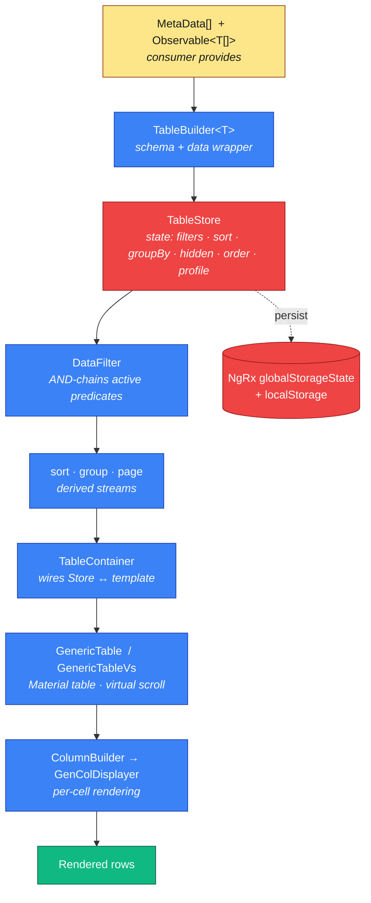
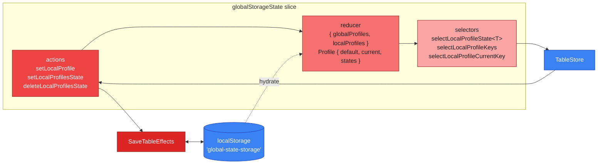
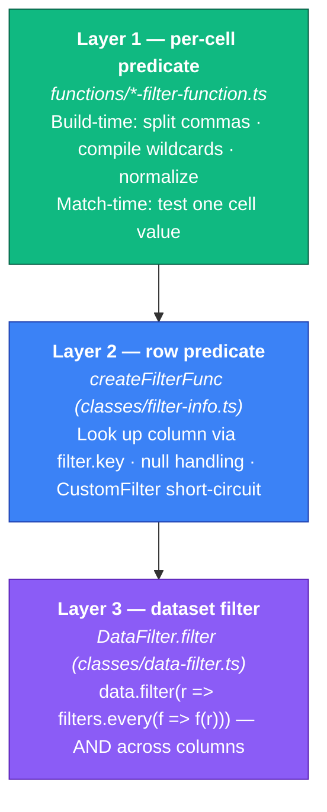
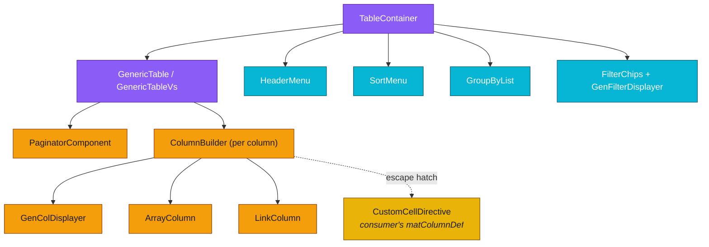
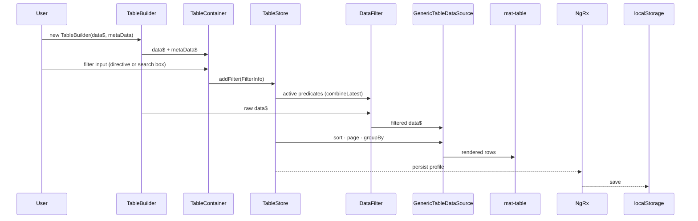

# Table Builder — Codebase Map

A mental model for `projects/angular-utilities/src/table-builder/` organized around **how data moves through the library**, not how files are organized on disk.

---

## 1. The Mental Model: A Pipeline

The library is a pipeline from `MetaData[] + Observable<T[]>` to rendered cells. Every feature — filter, sort, group, paginate, virtual-scroll, persist, inline-edit — is a stage of that pipeline. If you understand the stages, you know where to look for any behavior.

**Public surface** (`public-api.ts`): `TableBuilderModule`, `TableBuilder<T>`, `TableContainer`, `GenericTable`, `MetaData`, `FieldType`, `ReportDef`, `TableStore`, `FilterInfo`, directives, pipes. Everything else is internal.

**Wiring**: `TableBuilderModule.forRoot(config)` registers the `globalStorageState` NgRx feature, the `SaveTableEffects` effects, declares every component/directive/pipe, and provides `TableBuilderConfigToken`.

---

## 2. Stage Deep-Dives (in pipeline order)

### 2.1 State — `TableStore` + NgRx + persistence

`TableStore` (`classes/table-store.ts`) is an NgRx ComponentStore holding all interactive state: active filters, sort descriptors, visible/hidden columns, column order, pagination, groupBy, resizing, user-defined widths, initialization status. Every UI interaction flows into one of its `updater`s or `effect`s.

Persistence is piggy-backed on a feature slice (`ngrx/`) that holds **profiles** — named snapshots of savable state. `SaveTableEffects` watches `setLocalProfile(persist=true)` actions and writes to `localStorage` under `'global-state-storage'`; the slice is hydrated on boot.

**Key rule**: TableStore is a **dumb container**. It does not transform filter values, run predicates, or normalize input. All semantics live downstream in `DataFilter` / filter functions. Violating this has bitten us (comma-split in `addFilter` breaking debounced search round-trips).

### 2.2 Filter stage — three layers

A `FilterFunc<T,V>` = `(FilterInfo) => (val: V) => boolean`. Read it twice: the outer runs **once** when a filter is added/changed, the inner runs **once per row**.

- **Routing by `FieldType`** (`filterTypeFuncMap` in `filter-info.ts`): `String/Array/PhoneNumber/Unknown` → `StringFilterFuncs`; `Number/Currency` → `NumberFilterFuncs`; `Enum` → `EnumFilterFuncs`; plus `Date`, `DateTime`, `Boolean`.
- **CustomFilter** bypasses layer 1 entirely — the consumer provides the closed-over predicate directly.
- **Reactivity**: `DataFilter.appendFilters` composes filter streams; `combineLatest([data$, filters$])` re-runs the filter pass on any change.

**Where to fix a bug**:
| Symptom | Layer |
|---|---|
| Commas · wildcards · case · whitespace in filter value | 1 |
| Null rows passing/failing incorrectly | 2 |
| Nested-property access (`a.b.c`) | 2 |
| Filter not re-running when data changes | 3 |
| Filters behaving as OR instead of AND | 3 |

### 2.3 Sort · Group · Page

Applied after filtering as derived streams off `TableStore`:
- **Sort** — `functions/sort-data-function.ts`; multi-sort is handled by `MultiSortDirective` providing the `Sort[]` and `GenericTableDataSource.sortData` overriding the Material default.
- **Group** — `TableContainer` builds groups from the sorted filtered data using `tbGroupBy` + `groupHeaderTemplate`.
- **Page** — `PaginatorComponent` reads/writes pagination state on the Store.

### 2.4 Rendering

`TableContainer` is the orchestrator — it reads Store state and passes the final filtered/sorted/grouped/paged stream down. `GenericTable` (or `GenericTableVs` for virtual scroll) uses `GenericTableDataSource`, a thin adapter on top of `MatTableObservableDataSource` that swaps in multi-sort.

Per-cell rendering goes through `ColumnBuilder` → `GenColDisplayer`, with `CustomCellDirective` as the consumer's escape hatch (`matColumnDef` override).

---

## 3. End-to-End: filter click → rendered table

---

## 4. Extension Points — "I want to change X, touch Y"

| I want to… | Files / APIs |
|---|---|
| Render a column differently | Consumer template: `matColumnDef` + `CustomCellDirective` |
| Add a new built-in cell type | `components/column-builder` + `components/gen-col-displayer`; add a branch keyed on `FieldType` |
| Add a new `FilterType` | `enums/filterTypes.ts` (enum + `filterTypeMap` entry) · new entry in the relevant `*FilterFuncs` map in `functions/` · UI form branch in `components/filter/filter.component.html` |
| Add a new `FieldType` | `interfaces/report-def.ts` · route in `filter-info.ts` `filterTypeFuncMap` · render branch in `GenColDisplayer` |
| Inject one-off custom filter logic | Provide a `CustomFilter` with `predicate: (row) => boolean` — layer 1 is bypassed |
| Persist state elsewhere (e.g. backend profiles) | Subscribe to `TableStore.getSavableState()` · replace `SaveTableEffects` |
| Add a column-header menu item | `components/header-menu/*` + wire a `TableStore` updater |
| Change virtual-scroll viewport sizing | `directives/virtual-scroll-viewport.directive.ts` (`[offset]` input) |
| Override default table behavior globally | `TableBuilderConfig` via `TableBuilderConfigToken` at `forRoot(config)` |
| Add or change an export format | `services/export-to-csv.service.ts` · `functions/download-data.ts` |

---

## 5. Appendix — Folder cheat sheet

Needed only when extension points above send you to a folder and you want to browse siblings.

- **`classes/`** — state & data plumbing: `TableBuilder<T>`, `TableStore`, `TableState`, `DataFilter`, `FilterInfo`/`CustomFilter`, `MatTableObservableDataSource`, `GenericTableDataSource`, `TableBuilderConfig`, general/persisted settings, column helpers.
- **`components/`** — UI: containers (`table-container`, `generic-table` + `-vs`), column/display (`column-builder`, `gen-col-displayer`, `array-column`, `link-column`, `paginator`), filters (`filter`, `date-filter`, `date-time-filter`, `number-filter`, `in-filter`, `inlist-filter`), filter orchestration (`table-container-filter/*`), menus (`header-menu`, `sort-menu`, `group-by-list`).
- **`directives/`** — `custom-cell-directive`, `tb-filter.directive`, `multi-sort.directive`, `resize-column.directive`, `table-wrapper.directive`, `virtual-scroll-viewport.directive`, Mat*TbFilter barrel.
- **`functions/`** — pure predicates & helpers: `sort-data-function`, `*-filter-function`, `download-data`, `wildcard-to-regex`, `split-comma-value`.
- **`ngrx/`** — `actions`, `reducer`, `selectors`, `effects` (for the `globalStorageState` slice).
- **`services/`** — `export-to-csv`, `link-creator`, `table-template-service`, `transform-creator`.
- **`pipes/`** — `column-total`, `format-filter-type`, `format-filter-value`, `key-display`, `as-filter-pills`.
- **`interfaces/`** — `report-def` (`MetaData`, `FieldType`, `ReportDef`), `ColumnInfo`, `column-template`, `dictionary`.
- **`enums/`** — `filterTypes`.
- **Root** — `table-builder.module.ts`, `material.module.ts`.
