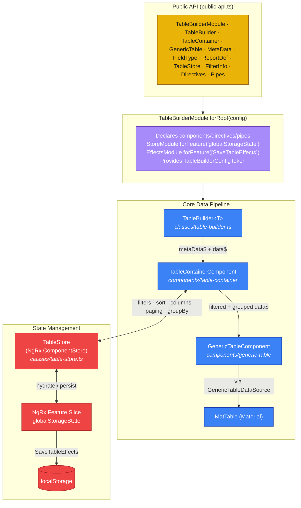
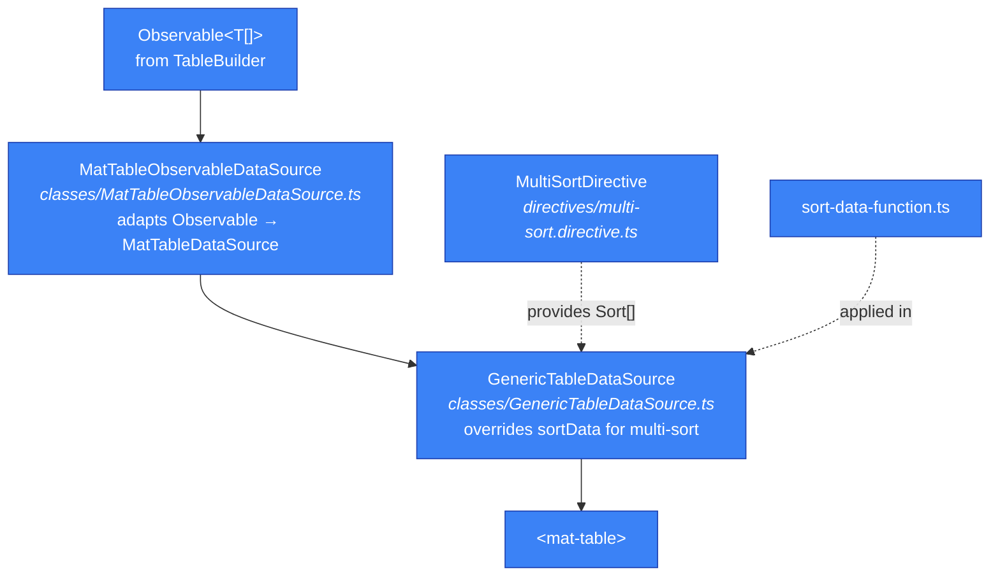
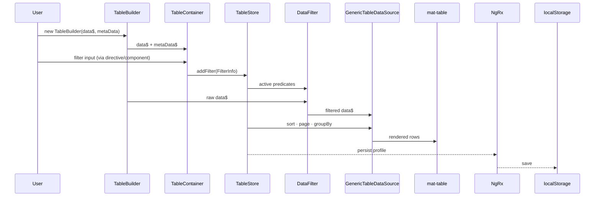

# Table Builder — Codebase Map

Visual map of `projects/angular-utilities/src/table-builder/`.

---

## 1. High-Level Architecture

---

## 2. Component Tree

```mermaid
flowchart TB
    TC["TableContainerComponent<br/>(orchestrator)"]

    TC --> INIT["InitializationComponent"]
    TC --> HM["HeaderMenuComponent"]
    TC --> SM["SortMenuComponent"]
    TC --> GBL["GroupByListComponent"]
    TC --> FL["FilterChipsComponent<br/><i>filter-list/</i>"]
    TC --> GFD["GenFilterDisplayerComponent"]
    TC --> GT["GenericTableComponent"]

    GT --> GTV["GenericTableVsComponent<br/>(virtual scroll variant)"]
    GT --> PAG["PaginatorComponent"]
    GT --> CB["ColumnBuilderComponent<br/>(dynamic per column)"]
    GT --> GCD["GenColDisplayerComponent<br/>(cell renderer)"]

    CB --> AC["ArrayColumnComponent"]
    CB --> LC["LinkColumnComponent"]

    GFD --> FC["FilterComponent"]
    GFD --> DF["DateFilterComponent"]
    GFD --> DTF["DateTimeFilterComponent"]
    GFD --> NF["NumberFilterComponent"]
    GFD --> INF["InFilterComponent"]
    GFD --> ILF["InListFilterComponent"]

    classDef container fill:#8b5cf6,stroke:#5b21b6,color:#fff
    classDef display fill:#f59e0b,stroke:#92400e,color:#1a1a1a
    classDef filter fill:#10b981,stroke:#065f46,color:#fff
    classDef menu fill:#06b6d4,stroke:#155e75,color:#fff

    class TC,GT,GTV container
    class CB,GCD,AC,LC,PAG,INIT display
    class FC,DF,DTF,NF,INF,ILF,GFD,FL filter
    class HM,SM,GBL menu
```

---

## 3. Filter Subsystem

```mermaid
flowchart LR
    subgraph USER["User / Template"]
        U1["[tbFilter] inputs<br/>(directives)"]
        U2["&lt;app-date-filter&gt;<br/>(components)"]
        U3["customFilters<br/>CustomFilter[]"]
    end

    subgraph DIR["Filter Directives<br/><i>directives/index.ts</i>"]
        TBF["TbFilterDirective"]
        MCF["MatCheckboxTbFilter"]
        MRF["MatRadioTbFilter"]
        MSF["MatSlideTbFilter"]
        MOF["MatOptionTbFilter"]
        MBF["MatButtonToggleTbFilter"]
    end

    subgraph CLASS["Filter Classes"]
        FI["FilterInfo<br/><i>classes/filter-info.ts</i>"]
        DFL["DataFilter<br/><i>classes/data-filter.ts</i>"]
        FTM["filterTypeMap<br/>FieldType → FilterType"]
    end

    subgraph FUNC["Filter Functions<br/><i>functions/</i>"]
        SFF["StringFilterFuncs"]
        NFF["NumberFilterFuncs"]
        DFF["DateFilterFuncs"]
        BFF["BooleanFilterFuncs"]
        NLF["NullFilterFuncs"]
    end

    USER --> DIR
    DIR -->|"filter$: Observable"| FI
    USER -.->|"filter$"| FI
    FI --> FTM
    FTM --> FUNC
    FUNC --> DFL
    DFL -->|"applied predicates"| STORE["TableStore.addFilter()"]

    classDef user fill:#fde68a,stroke:#92400e,color:#1a1a1a
    classDef dir fill:#14b8a6,stroke:#115e59,color:#fff
    classDef cls fill:#3b82f6,stroke:#1e40af,color:#fff
    classDef fn fill:#6b7280,stroke:#1f2937,color:#fff
    class U1,U2,U3 user
    class TBF,MCF,MRF,MSF,MOF,MBF dir
    class FI,DFL,FTM cls
    class SFF,NFF,DFF,BFF,NLF fn
    class STORE cls
```

---

## 4. NgRx Slice — `globalStorageState`

```mermaid
flowchart LR
    subgraph ACT["actions.ts"]
        A1["setLocalProfile"]
        A2["setLocalProfilesState"]
        A3["deleteLocalProfilesState"]
    end

    subgraph RED["reducer.ts"]
        R["GlobalStorageState<br/>{ globalProfiles, localProfiles }<br/>Profile { default, current, states }"]
    end

    subgraph SEL["selectors.ts"]
        S1["selectLocalProfileState&lt;T&gt;"]
        S2["selectLocalProfileKeys"]
        S3["selectLocalProfileCurrentKey"]
    end

    subgraph EFF["effects.ts"]
        E["SaveTableEffects<br/>watches setLocalProfile(persist=true)"]
    end

    LS[("localStorage<br/>'global-state-storage'")]
    TS["TableStore"]

    ACT --> RED
    RED --> SEL
    SEL --> TS
    TS --> ACT
    ACT --> EFF
    EFF <--> LS
    LS -.->|"hydrate on boot"| RED

    classDef act fill:#ef4444,stroke:#991b1b,color:#fff
    classDef red fill:#f87171,stroke:#991b1b,color:#1a1a1a
    classDef sel fill:#fca5a5,stroke:#991b1b,color:#1a1a1a
    classDef eff fill:#dc2626,stroke:#7f1d1d,color:#fff
    class A1,A2,A3 act
    class R red
    class S1,S2,S3 sel
    class E eff
```

---

## 5. Data Source Layer

---

## 6. File Inventory

### `classes/` — state & data plumbing
| File | Purpose |
|---|---|
| `table-builder.ts` | `TableBuilder<T>` — entry point, wraps data + metadata |
| `table-store.ts` | NgRx ComponentStore — filters, sort, columns, paging, groupBy |
| `TableState.ts` | Persisted + non-persisted state shapes; `InitializationState` |
| `data-filter.ts` | Chains filter predicates over the data Observable |
| `filter-info.ts` | `FilterInfo`, `CustomFilter`, `filterTypeMap`, `createFilterFunc` |
| `MatTableObservableDataSource.ts` | Observable → MatTableDataSource adapter |
| `GenericTableDataSource.ts` | Adds multi-sort to the data source |
| `TableBuilderConfig.ts` | DI token for runtime config |
| `table-builder-general-settings.ts` | `PersistedTableSettings` / `NotPersistedTableSettings` |
| `DefaultSettings.ts` | Array default style + limit |
| `display-col.ts`, `ColumnInfo.ts` | Column display helpers |

### `components/` — UI
**Containers:** `table-container`, `generic-table` (+ `generic-table-vs`), `initialization-component`
**Column/display:** `column-builder`, `gen-col-displayer`, `array-column`, `link-column`, `paginator`
**Filters:** `filter`, `date-filter`, `date-time-filter`, `number-filter`, `in-filter`, `inlist-filter`
**Filter orchestration:** `table-container-filter/gen-filter-displayer`, `table-container-filter/filter-list`, `table-container-filter/table-wrapper-filter-store`
**Menus:** `header-menu`, `sort-menu` (+ `sort-menu-component-store`), `group-by-list`

### `directives/`
`custom-cell-directive` · `tb-filter.directive` · `multi-sort.directive` · `resize-column.directive` · `table-wrapper.directive` · `virtual-scroll-viewport.directive` · `index` (barrel of Mat*TbFilter directives)

### `ngrx/`
`actions.ts` · `reducer.ts` · `selectors.ts` · `effects.ts`

### `functions/` — pure predicates & helpers
`sort-data-function` · `string-filter-function` · `number-filter-function` · `date-filter-function` · `date-time-filter-function` · `boolean-filter-function` · `null-filter-function` · `download-data`

### `services/`
`export-to-csv.service` · `link-creator.service` · `table-template-service` · `transform-creator`

### `pipes/`
`column-total.pipe` · `format-filter-type.pipe` · `format-filter-value.pipe` · `key-display`

### `interfaces/`
`report-def` (`MetaData`, `FieldType`, `ReportDef`) · `ColumnInfo` · `column-template` · `dictionary`

### `enums/`
`filterTypes` (`FilterType` enum, `FilterMap`)

### Root
`table-builder.module.ts` — module wiring · `material.module.ts` — Material/CDK re-exports

---

## 7. End-to-End Data Flow

